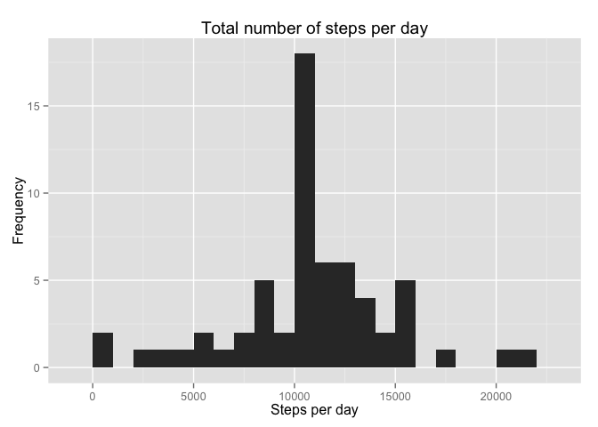

# Reproducible Research: Peer Assessment 1

### Loading and preprocessing the data

```r
unzip(zipfile="activity.zip")
data <- read.csv("activity.csv")
```
  
  
### What is mean total number of steps taken per day?
- Make a histogram of the total number of steps taken each day:

```r
library(ggplot2)
sum_steps <- tapply(data$steps, data$date, FUN=sum, na.rm=TRUE) 
# sum of steps for each date/group (date's class is factor)
# 61rows x 1column array. 
# rownames of the array are the dates.
```

```r
qplot(sum_steps, binwidth=1000, xlab="Steps per day", 
      ylab="Frequency", main="Total number of steps per day")
```

 

```r
      # Histogram of 61 frequencies
      # 10 days for which 0-1000 steps, 1 day 2000-3000, ..., 5 days 8000-9000 etc 
```
  
- Calculate and report the **mean** and **median** total number of steps taken per day:

```r
mean_steps <- mean(sum_steps, na.rm=TRUE)
median_steps <- median(sum_steps, na.rm=TRUE)
```
  
The **mean** number of daily steps is 9354.2295 and the **median** is 10395.  
  
  
### What is the average daily activity pattern?
- Make a time series plot (i.e. `type = "l"`) of the 5-minute interval (x-axis) and the average number of steps taken, averaged across all days (y-axis):

```r
avg_steps <- aggregate(x=list(AvgSteps=data$steps), by=list(Interval=data$interval),
                      FUN=mean, na.rm=TRUE)
```

```r
ggplot(data=avg_steps, aes(x=Interval, y=AvgSteps)) +
  geom_line() +
  xlab("5-minute intervals") +
  ylab("Average number of steps") +
  ggtitle("Average steps across all days for each interval")
```

 
  
- Which 5-minute interval, on average across all the days in the dataset, contains the maximum number of steps?

```r
max_interval <- avg_steps[which.max(avg_steps$AvgSteps), ]
```
  
The 5 minute interval at 835 contains the greatest number of steps on average with value 206.17.


### Imputing missing values

- Calculate and report the total number of missing values in the dataset (i.e. the total number of rows with `NA`s):

```r
missing <- is.na(data$steps)
table(missing)
```

```
## missing
## FALSE  TRUE 
## 15264  2304
```

```r
num_missing_values = with(data, sum(is.na(steps)))
```
The total number of missing values is 2304.
  
  
- Devise a strategy for filling in all of the missing values in the dataset. The strategy does not need to be sophisticated. For example, you could use the mean/median for that day, or the mean for that 5-minute interval, etc:

```r
# Replace each missing value with the mean value of its 5-minute interval
filling <- function(x, y) {
  fill <- NA
  if (!is.na(x))
    fill <- x
  else
    fill <- avg_steps[avg_steps$Interval==y, "AvgSteps"]
    #if condition TRUE fill gets the AvgSteps value for the Interval where the row belongs.
  return(fill)
}
data_filled <- data
data_filled$steps <- mapply(filling, data_filled$steps, data_filled$interval)
# applies the function 'filling' to the first element of x=data_filled$steps and
# the first element of y=data_filled$interval and so on.
# mapply returns a vector with the all 'steps' values, including filled.
# This vector is assigned to steps column.
```
  
- Make a histogram of the total number of steps taken each day and Calculate and report the **mean** and **median** total number of steps taken per day. Do these values differ from the estimates from the first part of the assignment? What is the impact of imputing missing data on the estimates of the total daily number of steps?


```r
sum_filled <- tapply(X = data_filled$steps, INDEX = data_filled$date, FUN=sum)
qplot(sum_filled, binwidth=1000, xlab="Steps per day", 
      ylab="Frequency", main="Total number of steps per day")
```

 

```r
mean(sum_filled)
```

```
## [1] 10766
```

```r
median(sum_filled)
```

```
## [1] 10766
```
  
Mean and median are higher after filling the missing values. The reason for that, is that in the
first case where NAs were ommited, many days had only NAs for all intervals which resulted
to 0 sum of steps for each of these days. As a result the mean and median ended up to lower values.

### Are there differences in activity patterns between weekdays and weekends?

- Create a new factor variable in the dataset with two levels -- "weekday" and "weekend" indicating whether a given date is a weekday or weekend day.


```r
data_filled$date <- as.Date(data_filled$date)
week <- function(x) {
  day <- weekdays(x)
  if (day %in% c("Monday", "Tuesday", "Wednesday", "Thursday", "Friday"))
    return("weekday")
  else if (day %in% c("Saturday", "Sunday"))
    return("weekend")
  else
    stop("invalid date")
}
data_filled$day <- sapply(X=data_filled$date, FUN=week)
```
  
- Make a panel plot containing a time series plot (i.e. `type = "l"`) of the 5-minute interval (x-axis) and the average number of steps taken, averaged across all weekday days or weekend days (y-axis). The plot should look something like the following, which was created using **simulated data**:


```r
avg_steps2 <- aggregate(steps ~ interval + day, data=data_filled, FUN=mean)
# mean of steps for each combination of interval + day (weekday and weekend)
# e.g. 0 interval + weekday, 0 interval + weekend, 5 interval + weekday, 5 interval + weekend etc.
ggplot(avg_steps2, aes(interval, steps)) + geom_line() + facet_grid(day ~ .) +
  xlab("Interval") + ylab("Number of steps")
```

 

